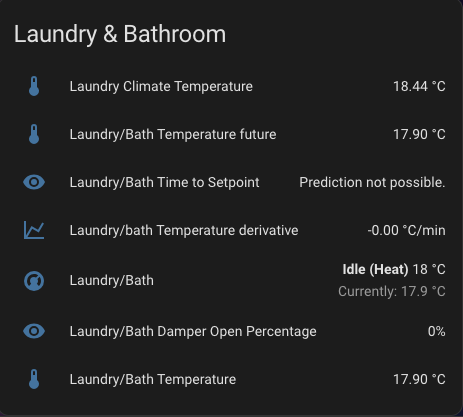

# Home-assistant-Climate-helpers

The following helpers will create 3 climate prediction sensors. 
First implemented to montior the performace of my newly installed ducted heating and cooling system.

# Create the sensors

Derivative sensor: 
Name: sensor.room_temperature_derivative 
Precision: 2 
Time window: 0:15:00 
Time unit: Minutes 

Template Sensor: 
Entity ID naming Convention: sensor.room_temperature_future

Template Sensor: 
Entity ID naming Convention: sensor.room_time_to_setpoint

Dashboard card pulling airtouch information combinded with the prediction sensors. 

# Limitations
Time to setpoint sensor only works for heating currently. 
Needs an update to account for cooling modes.